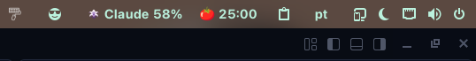
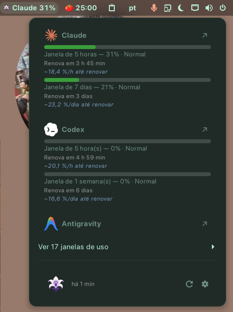
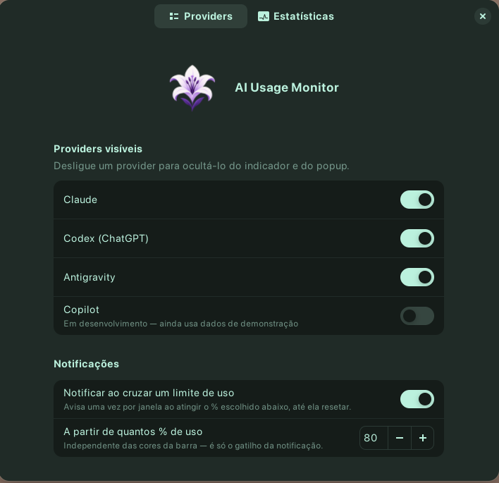
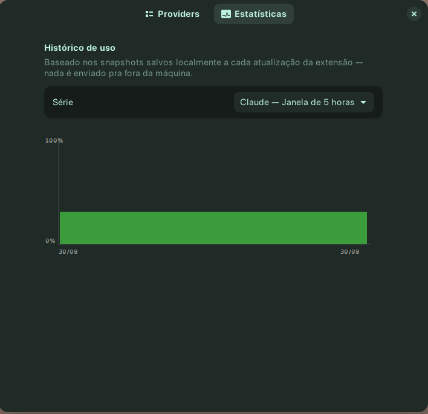

# AI Usage Monitor for GNOME


A GNOME Shell extension that shows, at a glance, how much of your AI
subscriptions (Claude, ChatGPT/Codex, Gemini, GitHub Copilot) you've already
used — one indicator in the top bar instead of checking each app.

> Monitors **usage/quota**, never money spent.
>
> The extension's UI (popup, preferences, notifications) is in Portuguese
> (pt-BR) for now — that's why the screenshots below show Portuguese text.

## Why this exists

If you juggle more than one AI subscription day to day, it's easy to get
blindsided by a limit hitting mid-task. This extension puts all of them in
one place: a click on the top bar shows how much is left on each, and when
it renews.

## Features

- **Top bar indicator** — shows the name and percentage of whichever
  subscription is closest to its limit (not an average, so a nearly-maxed
  one never hides behind the others).
- **Popup with per-provider detail** — every configured AI gets its own
  card: usage bars per window (e.g. 5-hour and weekly), reset countdown,
  and a shortcut link straight to that provider's own usage/billing page.
  Providers with lots of windows (e.g. Antigravity, one per model) collapse
  into a dropdown so the popup never outgrows your screen.
- **"Safe pace" projection** — under each bar, a quick read on how much %
  you can still spend per hour/day before it renews, worked out from the
  percentage and reset time you already see (no extra tracking needed).
- **Configurable limit notifications** — get a system notification the
  moment any window crosses a % you choose, once per window until it
  resets. Default threshold is 80%, adjustable (or turn it off entirely)
  in Preferences.
- **Local usage history + trend chart** — a "Statistics" tab in
  Preferences shows a daily bar chart (peak usage per day, color-coded)
  per provider/window, built from snapshots saved on your machine — never
  sent anywhere.
- **Real quota, not an estimate** — Claude, Codex and Antigravity show the
  actual percentage from your account, reusing the login you already did
  in the official CLI (see [Privacy & security](#privacy--security)).
- **Preferences** — hide any provider you don't use from the indicator and
  popup, individually.
- **Manual + automatic refresh** — the popup opens instantly from cache
  (no network call just to look), refreshes in the background, and never
  lets one provider's failure hide the others.
- **Fully local** — no accounts of its own, no telemetry, no external
  server.

## What's real vs. still in progress

| AI | Status | What it shows |
|---|---|---|
| **Claude** (Claude Code) | ✅ Real data | Real percentage of the 5-hour and 7-day windows, straight from your account. |
| **Codex** (ChatGPT) | ✅ Real data | Real percentage of Codex CLI's 5-hour and weekly windows. |
| **Antigravity** (Gemini) | ✅ Real data | Real per-model quota from the official Antigravity CLI (`agy`), reusing its own login — doesn't cover the Gemini web app's usage counter, which has no public API. |
| **GitHub Copilot** | 🚧 In progress | Demo data for now — an official API exists, integration isn't wired up yet. |

## Screenshots

| Top bar indicator | Popup |
|---|---|
|  |  |

### Preferences



### Statistics



## Requirements

- Linux with GNOME Shell 45–48 (tested on Zorin OS 18 / GNOME Shell 46).
- For **Claude** real data: [Claude Code](https://claude.com/claude-code)
  installed and logged in (`claude auth login`).
- For **Codex** real data: [Codex CLI](https://developers.openai.com/codex/cli)
  installed and logged in (`codex login`).
- For **Antigravity** real data: [Antigravity CLI](https://antigravity.google/docs/cli/install)
  (`agy`) installed and logged in.
- Without those, the extension still works fine — the corresponding card
  just shows "authentication required" instead of a percentage.

## Installation

Not on extensions.gnome.org yet, so this is the only way to install it for
now.

```bash
git clone https://github.com/tiagomeconi/ai-tracking-gnome.git
cd ai-tracking-gnome
./scripts/install.sh
```

Then log out/in (Wayland) or restart the Shell with <kbd>Alt</kbd>+<kbd>F2</kbd>,
<kbd>r</kbd>, <kbd>Enter</kbd> (X11 only), and enable it:

```bash
gnome-extensions enable ai-usage-monitor@prohound.io
```

To remove it later: `./scripts/uninstall.sh`.

## Usage

Click the indicator in the top bar to open the popup:

- Each card shows the provider's name, usage bar(s), how much % you can
  still safely spend per hour/day before it resets, and when each window
  resets.
- Providers with many windows (e.g. Antigravity) collapse into a "N
  windows — click to expand" dropdown.
- The **↗** button next to a provider's name opens that provider's own
  usage/billing page in your browser.
- **↻** at the bottom refreshes on demand; the timestamp next to it shows
  when data was last fetched.
- **⚙** opens **Preferences**, where you can hide any provider you don't
  want to see, turn limit notifications on/off and set the % that
  triggers them, and open the **Statistics** tab (a daily usage chart per
  provider/window, built from history saved locally).

## Troubleshooting

- **Indicator doesn't show up after enabling** — GNOME Shell only reloads
  extension code on a Shell restart. On Wayland, log out and back in; on
  X11, <kbd>Alt</kbd>+<kbd>F2</kbd>, <kbd>r</kbd>, <kbd>Enter</kbd> restarts
  the Shell in place.
- **Claude/Codex/Antigravity show "authentication required"** — make sure
  you're logged in on the CLI itself (`claude auth login` / `codex login`
  / `agy`); the extension reuses that session, it doesn't have its own
  login.
- **A card shows a temporary error that clears up on its own** — usually a
  provider's own rate limit from refreshing too often; it recovers
  automatically.
- **Something else looks wrong** — check the Shell's log for errors:

  ```bash
  journalctl --user -f -o cat /usr/bin/gnome-shell
  ```

## Privacy & security

- Fully open source — audit it yourself.
- No telemetry, no server of ours: the extension only talks directly to
  the providers' own official/internal APIs (Anthropic, OpenAI, Google).
- No credential is ever stored, logged, or sent anywhere else — tokens
  (file-based for Claude/Codex, system keyring for Antigravity) are read
  into memory only to build one request, never written anywhere.
- No web scraping, no browser session cookies — it only reuses the login
  the official CLIs already made for themselves.
- The usage history behind the Statistics chart is a local file
  (`~/.cache/ai-usage-monitor/history.jsonl`, pruned after 30 days) — it
  never leaves your machine.

## Feedback

This project is in internal testing. Found a bug, want another AI
supported, or have a UI suggestion? Open an
[issue](https://github.com/tiagomeconi/ai-tracking-gnome/issues).

## Development

The extension lives at `extension/`. Install it with the symlink method
above (`scripts/install.sh`) — it lets the Shell load the code straight
from your working copy.

Domain logic (`extension/lib/**`) has no GNOME Shell dependency, so its
tests run under plain Node:

```bash
npm test
```

Project structure, architecture decisions (ADRs), and the research behind
each provider are in [`docs/DEVELOPMENT.md`](./docs/DEVELOPMENT.md).

## Credits

The technique of reusing the official CLIs' own OAuth login (Claude
Code/Codex) to query real quota was verified against the open-source
[tokidachi](https://github.com/Gaalbu/tokidachi) project (MIT), by Gabriel
Albuquerque. The same technique for Antigravity was verified against
[antigravity-usage](https://github.com/skainguyen1412/antigravity-usage)
(MIT).

## License

MIT — see [LICENSE](./LICENSE).
